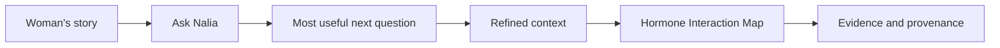
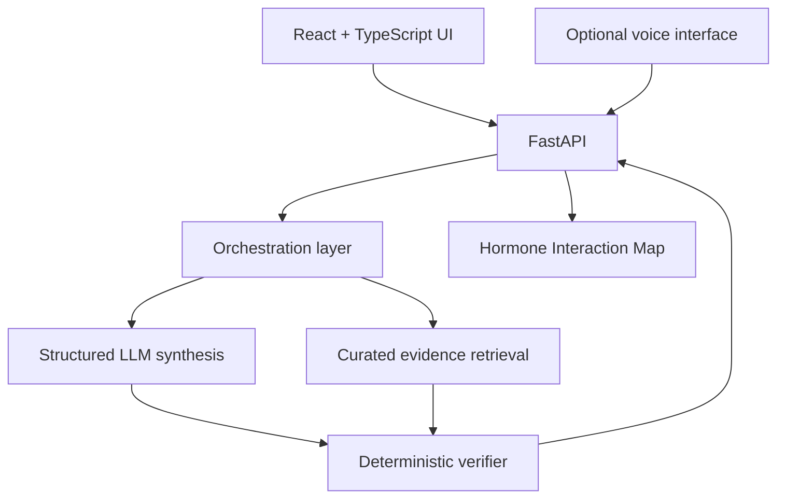

# Ask Nalia

**Hormone Interaction Intelligence for women**

Ask Nalia is an evidence-grounded prototype that helps a woman explore where hormones may fit into what she is experiencing, where they may not fit, what else may matter, and what the evidence can and cannot currently explain.

> **Never fill in the gaps. Find the gap that matters, then ask the woman.**

This repository is the **public showcase for the Elevate Women Global Hackathon 2026 project**. It documents the product, architecture, safety model, and representative data contracts. The deployable application, private evidence library, internal research, credentials, and continuing product development remain private within ProsightAI.

## Product flow

The result experience separates:

- **What Nalia noticed**
- **How the pieces may fit**
- **What else may matter**
- **What is uncertain**
- **What could help clarify the pattern**
- **Evidence and original sources**

## What Ask Nalia is not

Ask Nalia is not a diagnostic tool, prescription tool, cycle tracker, or clinician replacement.

It is designed to:

- distinguish association from causation
- surface uncertainty instead of hiding it
- avoid automatically validating a user's hormone theory
- preserve alternative explanations
- keep evidence provenance attached to claims
- keep user-reported facts separate from model-derived interpretation

## Technical architecture

The private implementation uses:

- **React + TypeScript + Vite**
- **FastAPI + Python + Pydantic**
- **n8n** for workflow orchestration
- **Supabase Postgres** for evidence storage
- **OpenAI models** for structured synthesis
- **ElevenLabs** for optional speech-to-text and text-to-speech
- **Vitest + Pytest** for automated testing

The LLM is **not** the final safety boundary. Structured output is checked again by deterministic backend rules before a result is returned.

## Evidence provenance

A factual statement is designed to be traceable:

**Claim → Evidence detail → Original source**

Evidence records carry explicit review status. Draft evidence is visibly marked as unverified until human review is complete.

## Adaptive questioning

The longer-term Ask Nalia design is not a long medical intake form. The system should identify the **smallest number of questions that materially changes the interpretation**.

The goal is to become:

> **more curious without becoming more confident than the science allows.**

## Voice

Voice is an interface layer only.

- speech becomes editable text before submission
- transcription must not add health facts the user did not say
- no conversational voice agent performs medical reasoning
- generated speech is limited to already-approved result text
- provider credentials remain server-side

## Engineering discipline

The private build includes automated coverage for API contracts, evidence retrieval, deterministic verification, red flags, evidence-level consistency, result-card consistency, voice transcription fidelity, failure handling, provenance UI, reports, accessibility, and responsive behavior.

At the time this showcase was prepared, the private build reported **148 backend tests and 113 frontend tests**.

## Product provenance

ProsightAI and the broader PMI Hormonal Health vision pre-date the hackathon prototype. Ask Nalia was developed as a focused standalone prototype during the Elevate Women Global Hackathon 2026, with the intention of later integrating the capability into PMI Hormonal Health.

See:

- [Architecture](docs/ARCHITECTURE.md)
- [Safety & Evidence](docs/SAFETY_AND_EVIDENCE.md)
- [Product Provenance](docs/PROVENANCE.md)
- [Technical Highlights](docs/TECHNICAL_HIGHLIGHTS.md)

## AI-assisted development

AI tools were used for implementation, debugging, testing, research support, and UI iteration under human direction and review. AI assistance does not automatically approve medical evidence and does not replace deterministic safety checks.

## Why this repository is intentionally limited

This public showcase does **not** expose API keys, internal evidence records, unpublished research, private prompts, user health data, production infrastructure configuration, or the private deployable source tree.

---

**ProsightAI Inc.**  
Public hackathon/technical showcase. This repository does not provide medical advice.
