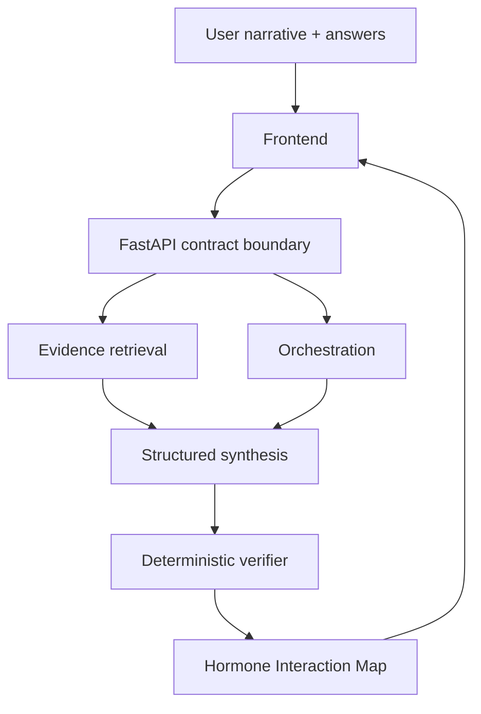

# Architecture

Ask Nalia separates three concerns that are often mixed together in AI health products:

1. **What the woman reports**
2. **What the evidence can support**
3. **What the system is allowed to say**

## High-level flow

## Frontend

The private product uses React + TypeScript and a guided state flow rather than a dashboard-heavy experience. The consumer sees a simple result first and can progressively open supporting evidence.

## Backend

FastAPI owns request validation, response schemas, server-side secrets, evidence lookup, orchestration calls, deterministic verification, and failure handling.

## Deterministic verification

Representative checks include:

- diagnostic-language restrictions
- causal-language gating
- source existence checks
- evidence-level consistency
- claim placement rules
- prevention of invented statistics, numbers, and sources
- explicit uncertainty handling

This safety layer is intentionally separate from the LLM prompt.

## Evidence storage

Evidence records use an explicit review workflow such as:

- `draft`
- `approved`
- `rejected`

Unapproved evidence must remain visibly labeled.

## Optional voice layer

Voice is an input/output layer, not a second medical reasoning system.
